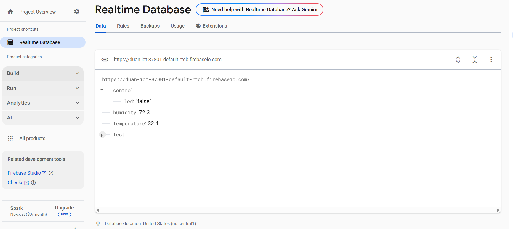
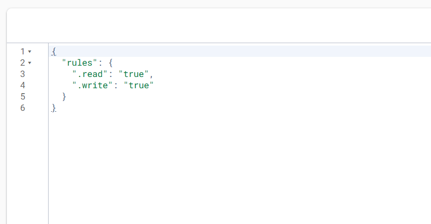
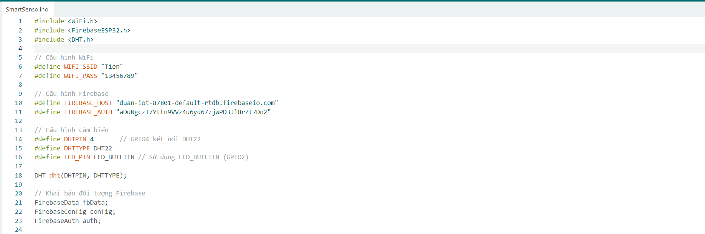
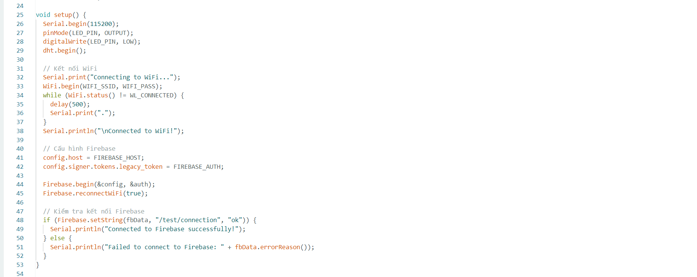
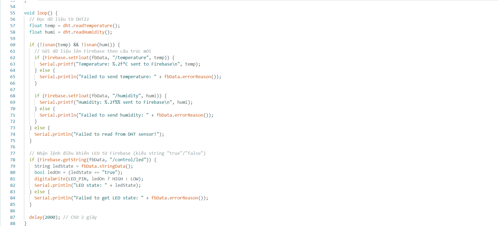
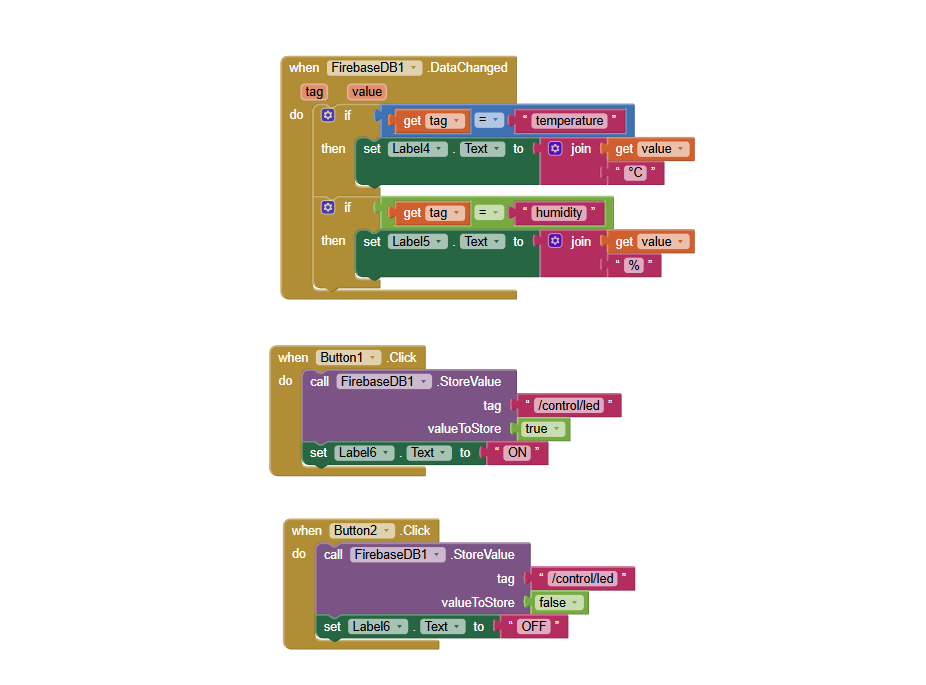
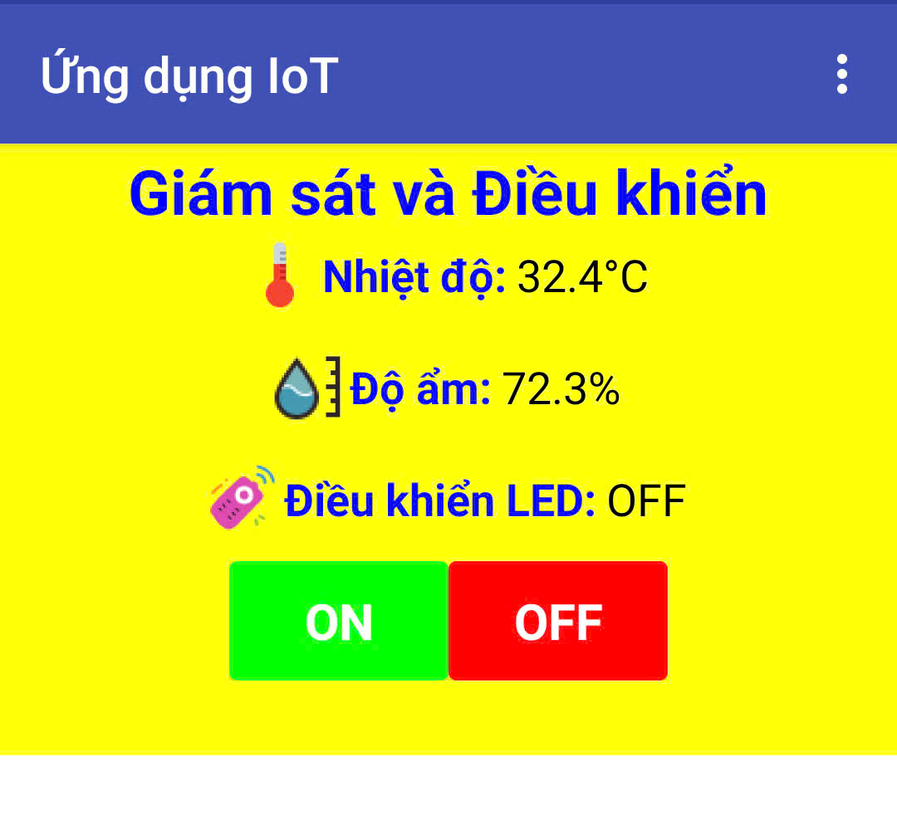

# 📱 Ứng dụng Giám Sát & Điều Khiển IoT

## 🎥 Video Demo

 

---

## 👨‍💻 Nhóm thực hiện

- **Trần Văn Đạt**
- **Bùi Thị Giang**
- **Nguyễn Trung Sơn**

---

## 📌 Tính năng chính

- Giám sát **nhiệt độ** và **độ ẩm** từ cảm biến.
- Điều khiển **bật/tắt LED** thông qua app.
- Lưu và hiển thị dữ liệu thời gian thực lên **Firebase Realtime Database**.
- Ứng dụng Android giao diện trực quan dễ sử dụng.

---

## 📸 Hình ảnh minh họa

### 🔥 Ảnh Firebase
| Dữ liệu Firebase | Cấu hình Rules |
|:----------------|:---------------|
|  |  |

---

### 💻 Ảnh Code
| Code 1 | Code 2 | Code 3 |
|:-------|:-------|:-------|
|  |  |  |

---

### 📱 Ảnh Thiết kế App
| Thiết kế Blocks | Thiết kế UI |
|:----------------|:------------|
|  |  |

---

### 📱 Ảnh App thực tế


---

## 🛠️ Hướng dẫn cài đặt:

### 📌 1. Cài đặt Arduino IDE
- Tải và cài Arduino IDE từ: [https://www.arduino.cc/en/software](https://www.arduino.cc/en/software)

### 📌 2. Thêm board ESP32 cho Arduino IDE:
- Vào **File > Preferences**
- Tại **Additional Board Manager URLs** dán: https://raw.githubusercontent.com/espressif/arduino-esp32/gh-pages/package_esp32_index.json
- Vào **Tools > Board > Boards Manager**
- Tìm **ESP32** và cài đặt

### 📌 3. Cài đặt thư viện:
- **Firebase ESP Client**
- **DHT sensor library**
- Cài trực tiếp trong **Tools > Manage Libraries**

### 📌 4. Kết nối Firebase:
- Tạo Realtime Database trên Firebase Console
- Lấy `Database URL` và `Secret key` để khai báo vào code Arduino

### 📌 5. Làm App bằng Mit App Inventor:
- Vào [https://ai2.appinventor.mit.edu/](https://ai2.appinventor.mit.edu/)
- Import file thiết kế blocks hoặc làm theo demo ảnh `Blocks.png`
- Kết nối API Firebase và control thiết bị

### 📥 Clone project từ GitHub

```bash
git clone https://github.com/trandat2004/IoTControlApp.git
```
